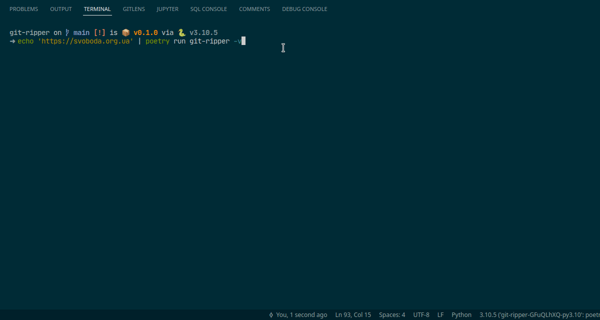

# Git Ripper ⚰️

Downloads git repo(s) from the web

Features:

- Asynchronous and fast.
- Mass git downloading.
- Unix-friendly for geeks.
- Colored output for gay people and transformers.
- Powered by Putin's 🇷🇺 dark energy.

From Russia with hate, szuki! Developed by secret KGB konstruktor buyro by red soviet communits hackers. Enjoy before you die in nuclear war...

```bash
$ pipx install git-ripper
$ git-ripper -i urls.txt
```


